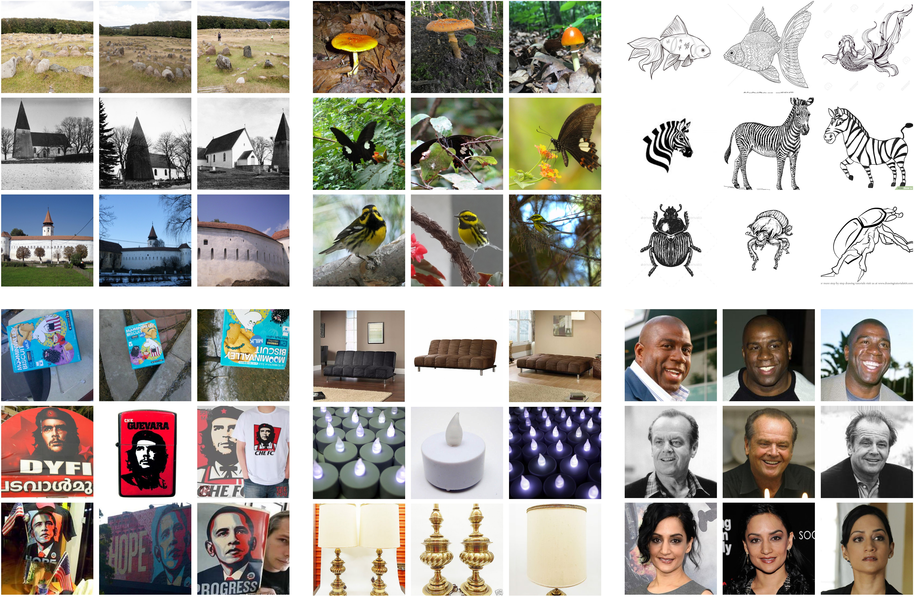
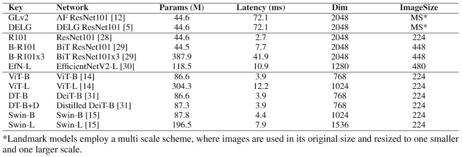

# GPR1200 Dataset

**GPR1200: A Benchmark for General-Purpose Content-Based Image Retrieval** ([ArXiv](https://arxiv.org/abs/2111.13122))

**Konstantin Schall, Kai Uwe Barthel, Nico Hezel, Klaus Jung**

[Visual Computing Group HTW Berlin](https://visual-computing.com/)


</img>


Similar to most vision related tasks, deep learning models have taken over in the field of content-based image retrieval (CBIR) over the course of the last decade. However, most publications that aim to optimise neural networks for CBIR, train and test their models on domain specific datasets. It is therefore unclear, if those networks can be used as a general-purpose image feature extractor. After analyzing popular image retrieval test sets we decided to manually curate GPR1200, an easy to use and accessible but challenging benchmark dataset with 1200 categories and 10 class examples. Classes and images were manually selected from six publicly available datasets of different image areas, ensuring high class diversity and clean class boundaries.

### Results:
</img>
</img>

## Download Instructions:

The images are available under this [link](https://visual-computing.com/files/GPR1200/GPR1200.zip). Unziping the content will result in an "images" folder, which contains all 12000 images. Each filename consists of a combination of the GPR1200 category ID and the original name: \
**"{category ID}_{original name}.jpg**

#### Update:
We now added a [JSON document](GPR1200_categoryNumber_to_text.json) that provides textual information for each of the GPR1200 categories. Please note, however, that the quality and granularity of the textual description varies greatly between subsets, since this information was obtained from the original dataset sources.

## Evaluation Protocol:

Images are not devided into query and index sets for evaluation and the full mean average precision value is used as the metric. Instructions and evalution code can be found in this repository.

[This notebook](eval/eval_notebook.ipynb) contains evaluation code for several models with Pytorch and the awesome [timm](https://github.com/rwightman/pytorch-image-models) library.

If you have precomputed embeddings for the dataset, you can run the eval script with the following command:

```bash
python ./eval/evaluate.py --evalfile-path '/path/to/embeddings' \
                            --mode 'embeddings' \
                            --dataset-path '/path/to/GPR1200/images'
```

In this case an evaluation file has to be provided that contains embeddings in the order created by the GPR1200 dataset object. This can be a npy file or a pickable python list.

```python
GPR1200_dataset = GPR1200('/path/to/GPR1200/images')
```

If you work with local features, it is best to provide nearest neighbours indices. For this case run the evaluation script in the indices mode:

```bash
python ./eval/evaluate.py --evalfile-path='/path/to/indices' \
                            --mode='indices' \
                            --dataset-path='/path/to/GPR1200/images'
```

## License Informations:

This dataset is available for for non-commercial research and educational purposes only and the copyright belongs to the original owners. If any of the images belongs to you and you would like it removed, please kindly inform us, we will remove it from our dataset immediately. Since all images were curated from other publicly available datasets, please visit the respective dataset websites for additional license informations. 

* [Google Landmarks v2](https://github.com/cvdfoundation/google-landmark)
* [iNaturalist](https://www.inaturalist.org/pages/developers) 
* [ImageNet Sketch](https://github.com/HaohanWang/ImageNet-Sketch) 
* [INSTRE](http://123.57.42.89/instre/home.html) 
* [Stanford Online Products](https://cvgl.stanford.edu/projects/lifted_struct/) 
* [IMDB-WIKI](https://data.vision.ee.ethz.ch/cvl/rrothe/imdb-wiki/)